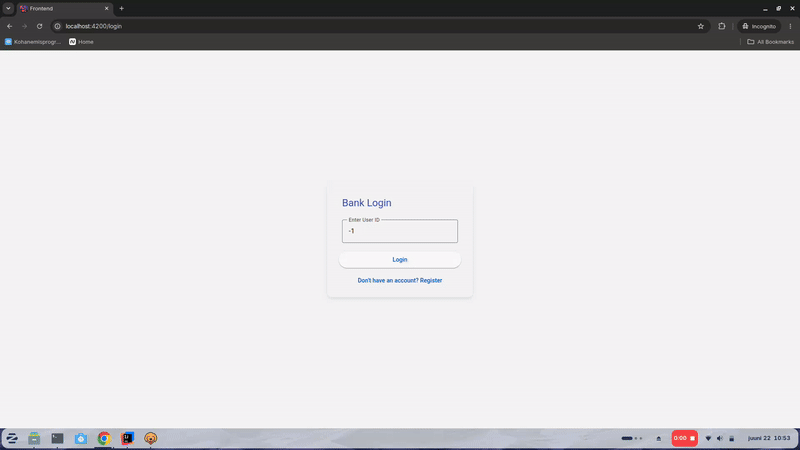

## Project structure
* [frontend](./frontend) -- angular SPA to run the frontend, requires node v26.3.1, use `npm install` and then `ng serve` to run, by default runs on port 4200
* [backend](./backend) -- spring boot webapp, requires JDK 21, use `./gradlew bootRun` to run, by default runs on port 8080

## Demo
